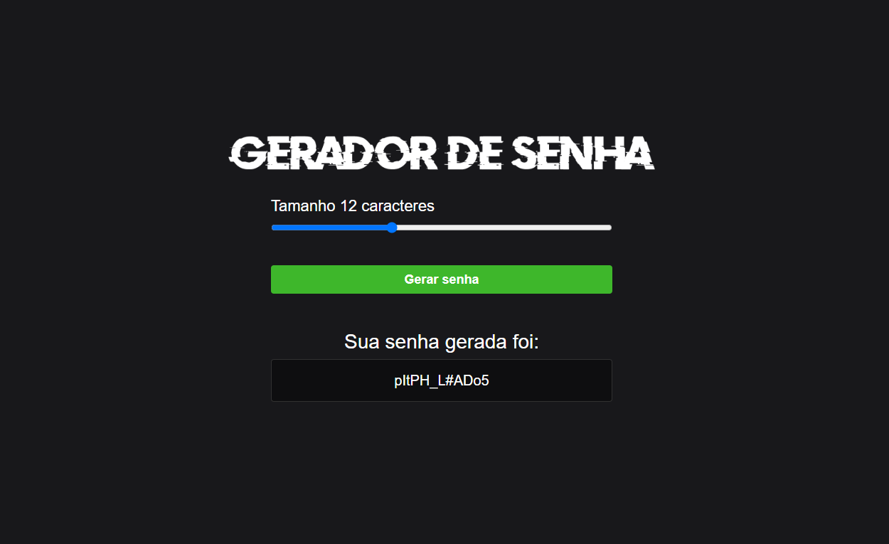

<h1 align="center"> Gerador de Senha ⚙️</h1>

# Sobre o gerador ⚙️
Esse projeto foi feito para aperfeiçoar minhas habilidades com o JS na criação de funções e eventos. 

# Apresentação 👀

  

# Tecnologias 💻
- HTML.
- CSS.
- JavaScript.

# Inspiração 💡

Projeto feito a partir de uma vídeo aula gratuita no YouTube, no canal Sujeito Programador 📺. 
https://www.youtube.com/@Sujeitoprogramador

# Autor 

Paulo Cesar  
